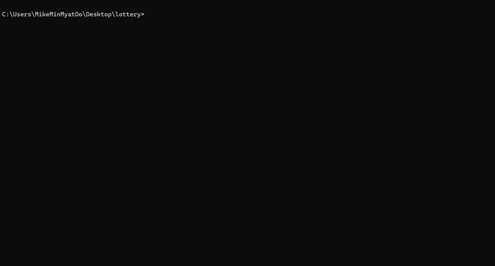

🎉 **Thai Lottery Checker** 🎉

Unleash your luck with this Node.js script! It's your personal Thai lottery investigator 🕵️‍♂️, checking if your Thai lottery number is a winner on a specific date. How does it work? 🪄 It scrapes the latest lottery results from the official Sanook News website, all thanks to the magic of the trusty Cheerio web scraping library.

🚀 **Installation:**

1. Clone this repository
2. Navigate to the project directory in your terminal
3. Run `npm install` to install the necessary dependencies

📆 **Usage:**

1. Run `npm start` in your terminal
2. Enter the date you want to check in the format `dd/mm/yyyy`
3. Input your lottery number(s) separated by commas (e.g., `123456, 654321`)
4. Choose whether you want to export the results to CSV and/or TXT files

📜 **Output:**

The script will display the results of your lottery number(s) for the given date in the terminal. If your number wins a prize, it'll shine in green, and the prize amount will be revealed.

Additionally, the script will create a directory called `lottery-results` in the project directory (if it doesn't exist) and save the results to CSV and/or TXT files, based on your selection during setup.

📊 **CSV Output:**

The CSV file will be named `results-<target_id>.csv` and will include these columns:

📋 **TXT Output:**

The TXT file will be named `results-<target_id>.txt` and will contain information for each winning number.

📄 **License:**

This script is licensed under the MIT License. 📜
